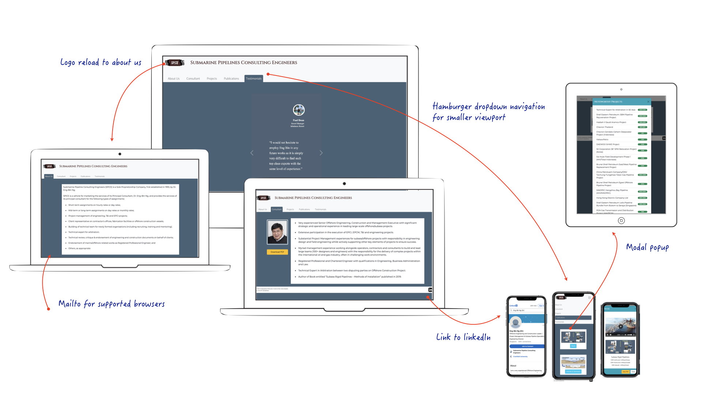

# Submarine Pipeline Consulting Engineers - SPiCE

SPiCE was built on the premise to extend Dr. Eng-Bin Ng's online presence as the premier consultant in engineering submarine pipelines for the Oil and Gas industry.

# UX - User Experience

Wireframe of the build design includes:

Deployed site can be found here: [submarinepipelines.com](https://submarinepipelines.com)

## Built With 
### Technologies
1. HTML 5.0 + CSS
2. Bootstrap 4.0 - CSS & JS [https://getbootstrap.com/](https://getbootstrap.com/)

### Styling
1. Google Fonts [https://fonts.google.com/](https://fonts.google.com/)
2. Gimp 2.10 [https://www.gimp.org/](https://www.gimp.org/) for image manipulation - alpha channels / gamma backgrounds.
3. Adobe Color [https://color.adobe.com/](https://color.adobe.com/) to extract IIFSC base color chart.

# Testing

[W3C Validator](https://validator.w3.org/) testing was done for all html files. All errors corrected and suggestion for language included. 

[Jigsaw CSS Validator](https://jigsaw.w3.org/css-validator/) testing was done for css file. No error was found.

| Action (development testing)             | Results              | Status  |
| -----------------------------------------|:--------------------:|---------|
| iOS safari mobile                        | numbers displays blue|         |
| iOS safari mob publication - video       | no autoplay          |         |
| Samsung 10/11 Chrome                     | wrapped tab          |         |                 
| iOS FireFox publication - video          | no autoplay          |         |
|                                          |                      |         |

| Action (deployed testing)                | Results          | Status   |
| -----------------------------------------|:----------------:|----------|
| Loading deployed page on iOS mobile      |                  |          |
| Loading deployed page on android mobile  |                  |          |
| Loading deployed page on Firefox         |                  |          |
| Loading deployed page on Chrome          |                  |          |
| Loading deployed page on Safari          |                  |          |
| Responsive testing on Firefox            |                  |          |
| Responsive testing on Chrome             |                  |          |
| Logo hyperlink                           |                  |          |
| Icon hyperlink                           |                  |          |
|                                          |                  |          |
| Navigation Bar                           |                  |          |
| Form submissions - invalid response      |                  |          |
| Form submissions - empty form            |                  |          |
| Form submissions - submit                |                  |          |

# Deployment
https://medium.com/@JinnaBalu/godaddy-domain-with-github-pages-62aed906d4ef

